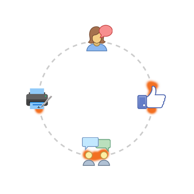

    

      
Hay una nueva forma de participar en política. Con el Partido Digital queremos actualizar nuestra democracia aportando participación y transparencia basándonos en tecnologias de la información y comunicación. Esta innovación se traslada también a la forma de hacer política.

      
Ya no tendrás que adaptarte a las estructuras partidarias para hacer algo por tu país. El Partido Digital se adapta a vos, a tu tiempo disponible, tus habilidades y al punto del país en el que te encuentres.

    

    

        
    

## Firmas

Estamos en el proceso de conseguir todas las firmas necesarias para inscribirnos oficlamente como partido político en la Corte Electoral. Queremos que todos quienes nos apoyan puedan ser artífices de este hecho fundamental del Partido Digital.

A continuación se encuentran las acciones que puedes hacer para ayudarnos relacionadas a la recolección de firmas para fundar el Partido Digital. Recuerda que la firma significa estar de acuerdo con que el Partido Digital se pueda presentar en las próximas elecciones y con su programa de principios accesibles [aquí][principios].

5 minutos | 10 minutos | 15 minutos | 30 minutos
---|---|---|---
Descarga el [pdf] e imprimilo | Pedile firmas a tu familia | Pedirle firmas a tu familia   y 5 amigos | Contarle a 10 por Facebook del PD   y preguntarles si quieren firmar

Para cualquier caso, te dejamos este texto para ayudarte a explicar qué es el Partido Digital:

> El Partido Digital es un nuevo partido político en Uruguay. Distinto a todos, pero distinto en serio, porque no votás a ningún candidato sino que te votás a vos mismo. Queremos actualizar la Democracia utilzando los últimos avances tecnológicos para dar más participación y transparencia. Las 3 diferencias principales con el resto de los partidos políticos son: cada representante del Partido Digital va a votar siempre de acuerdo a lo que se elige previamente en un sitio web al que pueden acceder todos los uruguayos, sus propuestas se elaborarán de forma colaborativa y abierta donde todos pueden aportar ideas de forma presencial u online y las finanzas del Partido Digital y en los lugares en donde actuemos serán 100% transparentes y disponibles online en cualquier momento. Si querés conocer más y registrate podés hacerlo en la web [https://partidodigital.org.uy][web].

 [Descargar hoja para recolectar firmas][pdf]{: .btn}

## Actividades

El Partido Digital no solo se basa en tecnologias de la información y comunicación o TICs, sino que también necesita de contacto cercano con la gente, como cualquier otro partido político. Las TICs son solo la herramienta con la cual podemos conectarnos entre todos fácilmente para poder colaborar sin tener que crear un comité de base con capacidad de más de 3 millones de personas.

El contacto cercano con la gente sucede tanto mensualmente los primeros lunes de cada mes como también en reuniones a demana con representantes del Partido Digital para poder generar un espacio más íntimo con personas allegadas para hablar del Partido Digital y sus valores. También pueden haber otras actividades disponibles, este es el calendario público del Partido Digital:

<iframe src="https://calendar.google.com/calendar/embed?title=Partido%20Digital&amp;showTitle=0&amp;showNav=0&amp;showPrint=0&amp;showTabs=0&amp;showCalendars=0&amp;showTz=0&amp;mode=AGENDA&amp;height=600&amp;wkst=1&amp;hl=es_419&amp;bgcolor=%23ffffff&amp;src=pdigitaluy%40gmail.com&amp;color=%231B887A&amp;ctz=America%2FMontevideo" style="border-width:0; margin: 10px; height: 200px;" width="100%" frameborder="0" scrolling="no"></iframe>

A continuación se encuentran las acciones que puedes hacer para ayudarnos relacionadas con asistir a actividades del Partido Digital. Ten en cuenta que las reuniones mensuales son a las 20hs en Sinergia Cowork (Gonzalo Ramirez 1676 entre Magallanes y Minas) y que las reuniones a demanda pueden ser coordinadas al mail [hola@partidodigital.org.uy].

30 minutos | 1 hora | más de 1 hora
---|---|---
Conectate a la reunión mensual online el próximo  mediante nuestra página de Facebook [aquí][facebook] | Venir a la reunión mensual el próximo  | Invitar a 5 personas allegadas y venir juntos a la reunión mensual el próximo  u organiza una reunión particular con más de 5 personas allegadas

[Enviar correo para pedir una reunión particular][hola@partidodigital.org.uy]{: .btn}

## Propuestas

Como sabrás, el Partido Digital quiere el aporte de todos para generar propuestas que tengan en cuenta las ideas y conocimiento de todos aquellos que esten dispuestos a brindarlo, de manera de generar propuestas responsables que integren el programa de gobierno del Partido Digital.

A continuación se encuentran las acciones que puedes hacer para ayudarnos relacionadas con las propuestas del Partido Digital. Las mismas se encuentan en nuestra herramienta de Debate en [https//debate.partidodigital.org.uy][debate].

5 minutos | 10 minutos | 15 minutos | 30 minutos | 1 hora | más de 1 hora
---|---|---|---
Registrate en la la herramienta de Debate | Visitá las propuestas de tu tema de interés y selecioná la que te gusta. Enviale un mail a un amigo que le pueda interesar | Selecciona una propuesta de tu interés en nuestra herramienta de debate y aporta un comentario | Rellena información faltante que puedas investigar en alguna propuesta de tu área de experiencia | Subir una propuesta en tu tema de interés o área de experiencia | Subir una propuesta en tu tema de interés o área de experiencia. Mandásela a 3 allegados que pienses que le pueden interesar

[Entrar a la herramienta de Debate][debate]{: .btn}

## Contenido

Como el Partido Digital es un nuevo partido político y se basa estrictamente en la colaboración de todos los Uruguayos, es importante que nuestra propuesta le llegue a la mayor cantidad de personas posible.

A continuación se encuentran las acciones que puedes hacer para ayudarnos relacionadas con compartir contenido del Partido Digital. Nuestras redes sociales son nuestra página de Facebook [aquí][facebook] y nuestro Twitter [aquí][twitter].

5 minutos | 10 minutos | 15 minutos
---|---|---
Compartir con tu propio comentario personal nuestra última publicación de nuestras redes sociales | Compartir con tu propio comentario mencionando amigos que les pueda interesar nuestra última publicación de nuestras redes sociales | Comenta alguna de nuestras últimas publicaciones haciéndonos llegar tu opinión personal sobre el Partido Digital

[Ir a nuestra página de Facebook][facebook]{: .btn}

[web]: https://partidodigital.org.uy
[principios]: /documentos/programa-de-principios
[pdf]: https://recursos.partidodigital.org.uy/assets/pdf/hoja_firma.pdf
[debate]: https://debate.partidodigital.org.uy
[facebook]: https://www.facebook.com/PDigitalUY
[twitter]: https://www.twitter.com/PDigitalUY
[hola@partidodigital.org.uy]: mailto:hola@partidodigital.org.uy